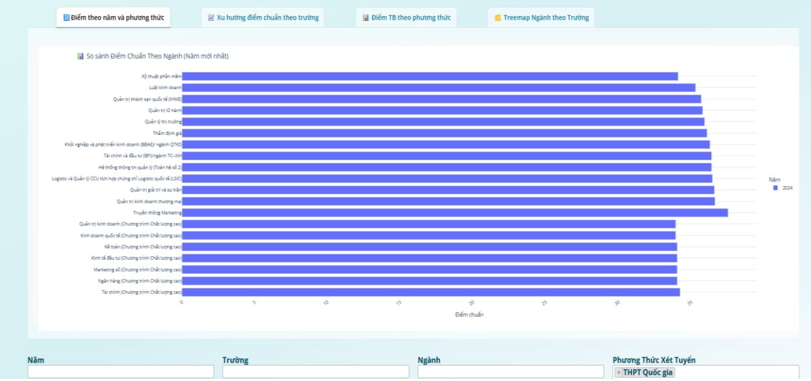

# SMART ENROLLMENT ASSISTANCE: A Predictive AI Chatbot for University Admission Insights and Data Visualization  
> Project conducted: 2024-2025 | Awarded 2nd Prize at DUE Student Scientific Research Conference

---d

## Introduction

This project was developed as part of the **Student Scientific Research Conference 2024-2025 at the University of Economics – University of Danang (DUE)**. Our team proudly achieved **Second Prize** with this work.

**Project Objective:**  
To build an AI-powered platform that integrates data visualization, personality assessment, and a smart chatbot to support students and parents in accessing **university admission information accurately, efficiently, and in a personalized way**.

**Note:**  
Currently, only the paper PDF is uploaded in this repository for readers to understand the system concept and detailed implementation. The code is **not publicly available** at this stage for intellectual property protection and potential future commercialization.

---

## Platform Functions Overview

The platform includes **three main features**:

### 1. Overview Dashboard

Provides an interactive data visualization dashboard for users to:
- Explore university admission data (cut-off scores, quotas, majors, schools, years, combinations).
- Filter and analyze data dynamically based on personal preferences.
- Identify trends, averages, and comparisons across majors and universities to support informed decision-making.

Example:

   
  <em>Treemap of admission scores by major and university</em>

   
  <em>Average admission score statistics by admission method</em>

   
  <em>Average admission score trends by university</em>

   
  <em>Comparison of admission scores across majors in the most recent year</em>

   
  <em>Quick recommendations for majors and universities by score range</em>

### 2. MBTI Test Module

An integrated **MBTI personality assessment** module allows users to:
- Complete a 70-question MBTI test online.
- Discover their personality type and its characteristics.
- Receive personalized **career and major recommendations** aligned with their MBTI type, aiding better academic and career orientation.

Example:

   
  <em>MBTI test interface</em>

   
  <em>Recommended majors based on MBTI personality types</em>

### 3. AI Chatbot for University Admission

This is the **core highlight** of the project:

- **Functionality:**  
  Enables users to ask free-form questions about:
  - University majors, cut-off scores, quotas, and admission methods (using structured data from a scraped dataset).
  - General information about DUE such as mission, training programs, and scholarships (using unstructured text data).

- **Technical Implementation:**  
  - Uses **Retrieval-Augmented Generation (RAG)** for context-aware, accurate responses.
  - Embedding with **intfloat/multilingual-e5-large-instruct** for semantic search, stored in **ChromaDB Vector Database**.
  - Combines **Function Calling** for structured queries with RAG for knowledge-based queries.
  - Built with **GPT-4o mini** for natural language generation.

- **Workflow Summary:**

   
  <em>Chatbot system architecture for university admission counseling</em>

  1. User submits a question.  
  2. System classifies intent (admission data lookup, general info, or casual query).  
  3. For structured data queries (e.g. cut-off scores), it uses Pandas for precise table filtering.  
  4. For unstructured knowledge (e.g. program description, mission), it performs semantic search via embeddings + RAG to retrieve top-k documents as context for the LLM to generate final answers.  
  5. Outputs are formatted clearly for user reading.

Example:

   
  <em>Chatbot interface</em>

   
  <em>Chatbot response result to user query</em>

- **Evaluation Results:**  
  - **Faithfulness score:** avg. 0.8996  
  - **Answer relevancy score:** avg. 0.8717

   
  <em>Evaluation chart of chatbot answer faithfulness and relevancy</em>

  - **Response time:**  
    - Normal queries: ~1–2s  
    - Complex RAG queries: ~30–40s
  

   
  <em>Comparison of execution time across different question types</em>

*For detailed technical architecture, evaluation metrics, and module design, please refer to the attached paper.*

---

## How to Use

To experience the platform, visit:  
**[SMART ENROLLMENT ASSISTANCE Demo](http://35.224.21.98:8080/login?next=%2F)**

   
  <em>Website interface</em>

---

## Learning Outcomes

Through this project, we:
- Developed skills in web scraping, data engineering, and dashboard visualization.
- Integrated psychological assessment (MBTI) into educational recommendation systems.
- Built and deployed a practical AI chatbot with **RAG + Function Calling** for real-world applications.
- Enhanced teamwork, project management, and presentation abilities, culminating in an award-winning research project.

---

## Documentation

- **[Project Paper PDF](./smart_enrollment_asisstance_paper_vietnamese.pdf)**

---

## Note on Code Availability

The code for this project is currently **not public** to protect intellectual property and due to potential future commercialization. For any collaboration or inquiry regarding this work, please contact the project team.
